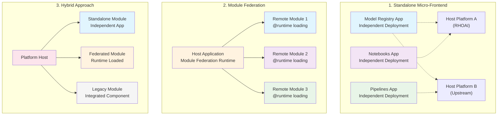

# Implementation Approaches

We support multiple implementation strategies to accommodate different deployment scenarios and organizational needs. Each approach has specific strengths and is suited for different contexts.

## Overview of Approaches

### 1. Standalone Micro-Frontend Approach

**Best for**: New features, upstream-first development, and independent deployment scenarios.

- Each feature is developed as a completely independent application
- Has its own repository, deployment pipeline, and release cycle
- Can be consumed by multiple host applications
- Follows strict upstream-first development practices

### 2. Module Federation Approach

**Best for**: Runtime composition, shared dependencies, and complex integration scenarios.

- Uses Webpack Module Federation for runtime composition
- Enables dynamic loading of micro-frontends
- Shares dependencies between modules at runtime
- Supports complex host-remote relationships

### 3. Hybrid Approach

**Best for**: Migration scenarios, mixed deployment requirements, and gradual adoption.

- Combines standalone and federated patterns
- Allows gradual migration from monolithic to modular
- Supports different integration patterns per module
- Flexible deployment options per module

## Implementation Details

For detailed setup instructions and examples, see:

- [Getting Started Guide](./10-getting-started.md) - Practical implementation steps
- [Shared Library Guide](./12-shared-library-guide.md) - Technical integration details
- [Technology Standards](./07-technology-standards.md) - Required tools and frameworks

## Choosing the Right Approach

| Factor | Standalone | Module Federation | Hybrid |
|--------|------------|-------------------|--------|
| **Development Independence** | ✅ High | ⚠️ Medium | ✅ High |
| **Runtime Composition** | ❌ No | ✅ Yes | ⚠️ Partial |
| **Shared Dependencies** | ❌ No | ✅ Yes | ⚠️ Partial |
| **Deployment Complexity** | ✅ Low | ⚠️ Medium | ❌ High |
| **Migration Friendly** | ⚠️ Medium | ❌ Low | ✅ High |

## Common Integration Patterns

All approaches use the same foundational patterns:

- **Shared Library Integration**: All modules use `mod-arch-shared` for common functionality
- **BFF Pattern**: Each module has its own Backend-for-Frontend service
- **Configuration System**: Common configuration interface across all deployment modes
- **Theme Support**: Consistent theming through shared providers

For specific implementation examples and step-by-step guides, refer to the specialized documentation files listed above.
